# Ansible - Installing web service on a remote server 
Using Ansible to install web service on a remote server. 
1. Web Service can be one of these: Apache2, nginx 
2. Separate components into files (e.g: "inventory" for list of remote servers, "playbook.yaml" is for the steps to install, …) 

--------------------------------------------------------------------------------------------------------------------

* Install Ansible on Control Node (Ansible Server):
 
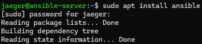
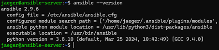
 
* Check SSH connection between Ansible server and Remote server (Managed host)

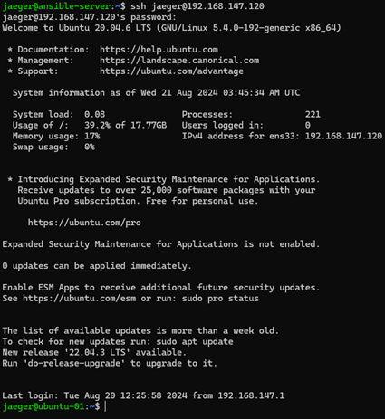
 
* Create a SSH keygen on Ansible server

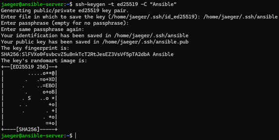
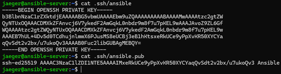
 
* Copy public key to Managed host:
 
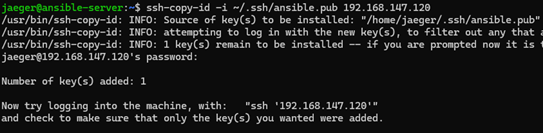
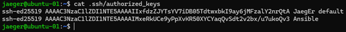

* Using Ansible to install web service Nginx on a remote server:
-	Edit inventory file:
 
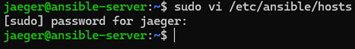
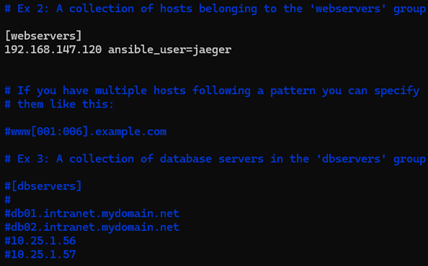

-	Create an yaml file to install Nginx on managed host:
 
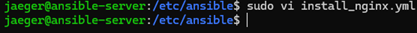
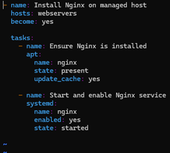
 
- Run the playbook: > ansible-playbook -i [playbook location] [playbook]
 
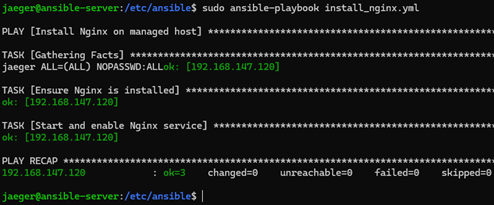 

- Check webserver on Managed host:
 
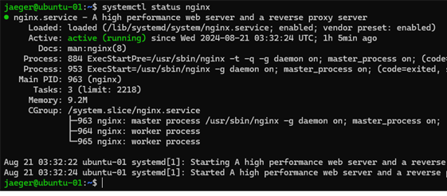 

- Check on browser:

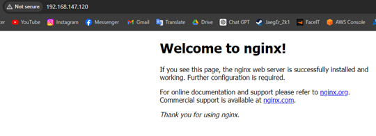