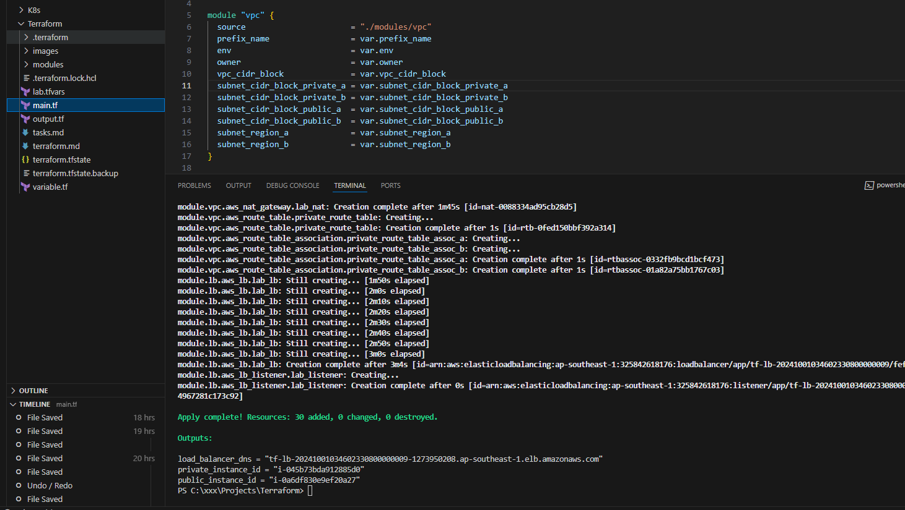
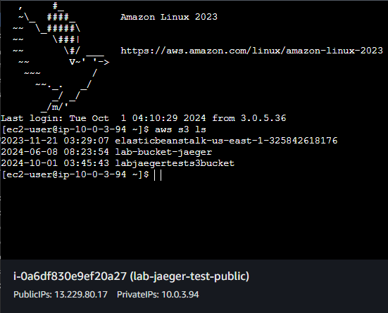
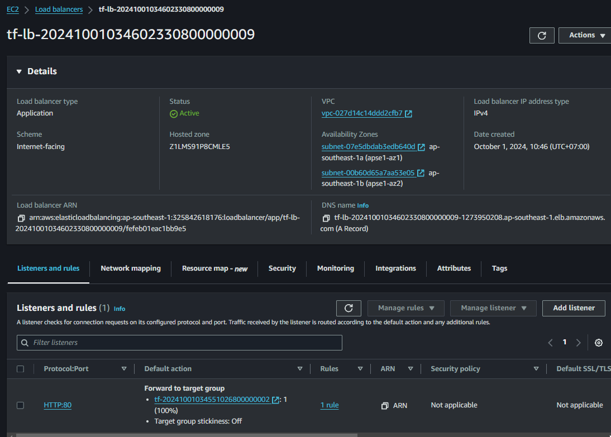
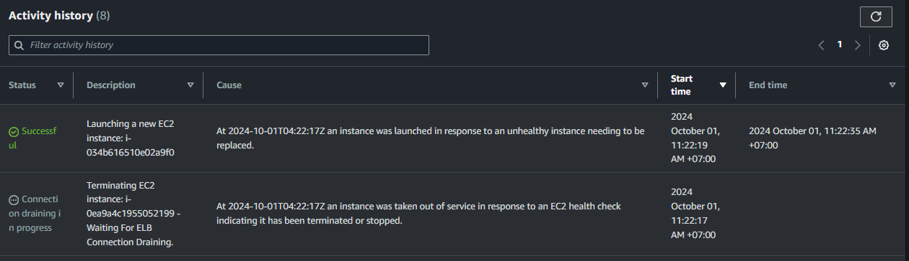
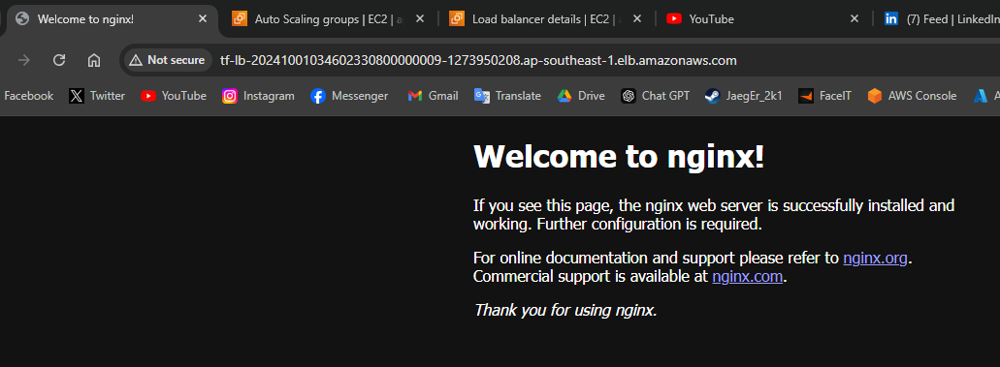
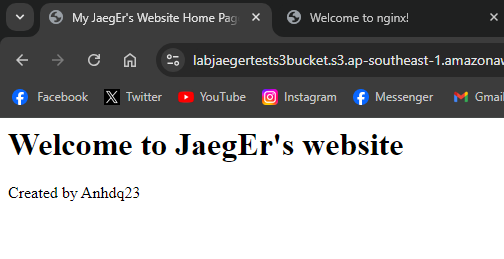

- Run command: terraform apply --var-file "lab.tfvars"

1. Create a module network with these requirement:
    - Input variable to the module: VPC CIDR
    - Resource created by the module:
        + VPC
        + 1 internet gateway
        + 1 nat gateway
        + 2 public subnets with thier route tables
        + 2 private subnets with thier route tables

    

2. Create 2 instance: 1 in public subnet and 1 in private that created in task 1
    - t3.micro 

    
    
    

    - User-data script for setting NGINX in public instance 
    - Configure the public instance network correctly so we can view from the internet

    

3. Create a service role for EC2 that allow to list all s3 buckets. Attach that role to EC2 instance (create in task 2) and verify that the instance able to use the list s3 bucket role 

4. Create an Application Load Balancer and an Auto-scaling Group

    - Test ASG: Delete one instance to see the ASG scale up

    - Test ALB: Use ALB dns to access the Nginx service

5. Setup an S3 bucket and host static web app using this bucket 

