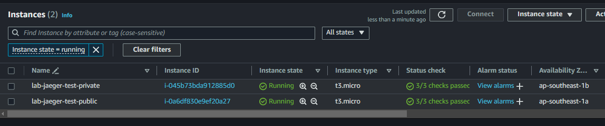
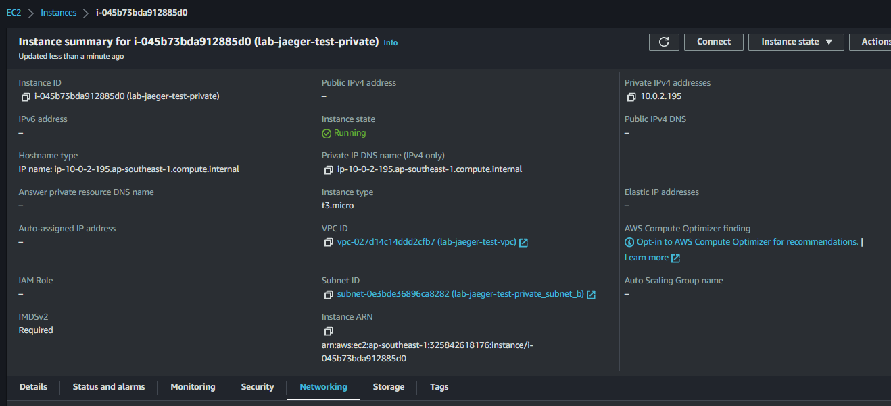
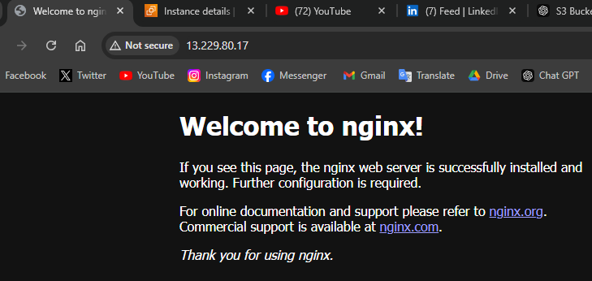

I. AWS IAM 
* Set up account:

 

* Set up MFA for your account 

 
* Navigate through AWS Console on web to get use to the UI 
 

* Try to create a user, create it with a prefix fadevops81<yourshortname> 

 
* Login into that account, try to play with editing policy permission for that user to be able/unable to view EC2 instances. 

 
* Create a group with a prefix fadevops@lgr<yourshortname> 
 
 

* Add the user fadevops@1<yourshortname> to the group. And try adding permission to this group 
 

* Remove the user, group, policy you created. 
* Setting up aws cli on your local machine 

 
* On your main AWS account, create Security Credentials and use that to finish setting up the aws cli. Verify the authentication by running some commands. 

 
* Use Terraform with the security credential you created on step 9 to set up a EC2 instance of type t2.micro on region Singapore (ap-southeast-1) 
 
 

* On the EC2 instance, install the aws cli (But do not attach any secret credential to it) 

 
* Create a service role for EC2 that allow to list all s3 buckets 

 
* Attach that role to EC2 and verify that the EC2 able to use the role by using aws cli command to list s3 bucket 
 
 

